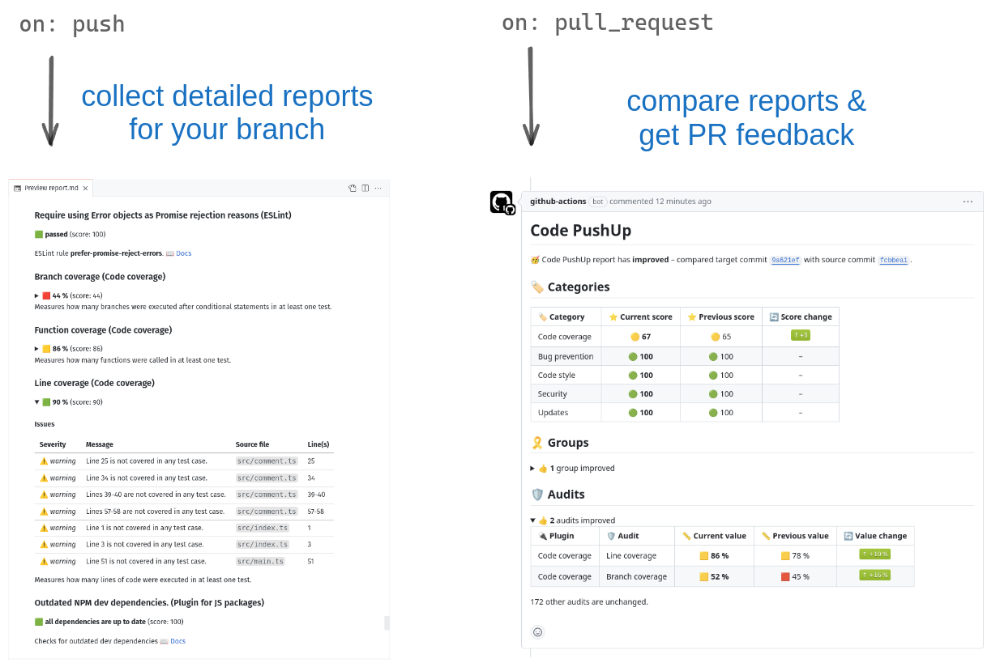

# Code PushUp GitHub Action

[](https://github.com/super-linter/super-linter)

[](https://github.com/actions/typescript-action/actions/workflows/check-dist.yml)
[](https://github.com/actions/typescript-action/actions/workflows/codeql-analysis.yml)
[](./badges/coverage.svg)

**🤖 GitHub Action for integrating
[Code PushUp](https://github.com/code-pushup/cli/tree/main/packages/cli#readme)
into your CI workflows.**



## Features

- 📃 Collects a Code PushUp report on push to remote branch.
- 📉 Uploads reports to workflow artifacts and/or Code PushUp portal (optional).
- 💬 When a PR is opened/updated, compares reports for source and target
  branches, and creates/updates a PR comment which summarizes the impact of the
  changes.
  - ⚠️ Also annotates changed files with new issues encountered by Code PushUp.

## Workflow example

```yml
name: Code PushUp

on:
  push:
    branches: [main]
  pull_request:
    branches: [main]

permissions:
  pull-requests: write

jobs:
  code-pushup:
    runs-on: ubuntu-latest
    steps:
      - uses: actions/checkout@v4
      - uses: actions/setup-node@v4
      - run: npm ci
      - uses: code-pushup/github-action@v0
```

## Action inputs

The action may be customized using the following optional inputs:

| Name          | Description                                                              | Default                                                                                                |
| :------------ | :----------------------------------------------------------------------- | :----------------------------------------------------------------------------------------------------- |
| `token`       | GitHub token for authorizing GitHub API requests                         | `${{ github.token }}`                                                                                  |
| `annotations` | Toggles if annotations should be created for relevant Code PushUp issues | `true`                                                                                                 |
| `artifacts`   | Toggles if artifacts will we uploaded/downloaded                         | `true`                                                                                                 |
| `retention`   | Artifact retention period in days                                        | from repository settings                                                                               |
| `directory`   | Directory in which `code-pushup` should run                              | `process.cwd()`                                                                                        |
| `config`      | Path to config file (`--config` option)                                  | see [`@code-pushup/cli` docs](https://github.com/code-pushup/cli/tree/main/packages/cli#configuration) |
| `silent`      | Toggles if logs from Code PushUp CLI are printed                         | `false`                                                                                                |
| `bin`         | Command for executing Code PushUp CLI                                    | `npx --no-install code-pushup`                                                                         |

For example, this will run `code-pushup` commands in a non-root folder and
retain report artifacts for 30 days:

```yml
- uses: code-pushup/github-action@v0
  with:
    directory: website
    retention: 30
```

## Action outputs

Some outputs are set in case you want to add further steps to your workflow.

| Name          | Description                      |
| :------------ | :------------------------------- |
| `artifact-id` | ID of uploaded report artifact   |
| `comment-id`  | ID of created/updated PR comment |

Example of using step outputs:

```yml
- uses: code-pushup/github-action@v0
  id: code-pushup
- run: |
    echo "Comment ID is ${{ steps.code-pushup.outputs.comment-id }}"
    echo "Artifact ID is ${{ steps.code-pushup.outputs.artifact-id }}"
```
